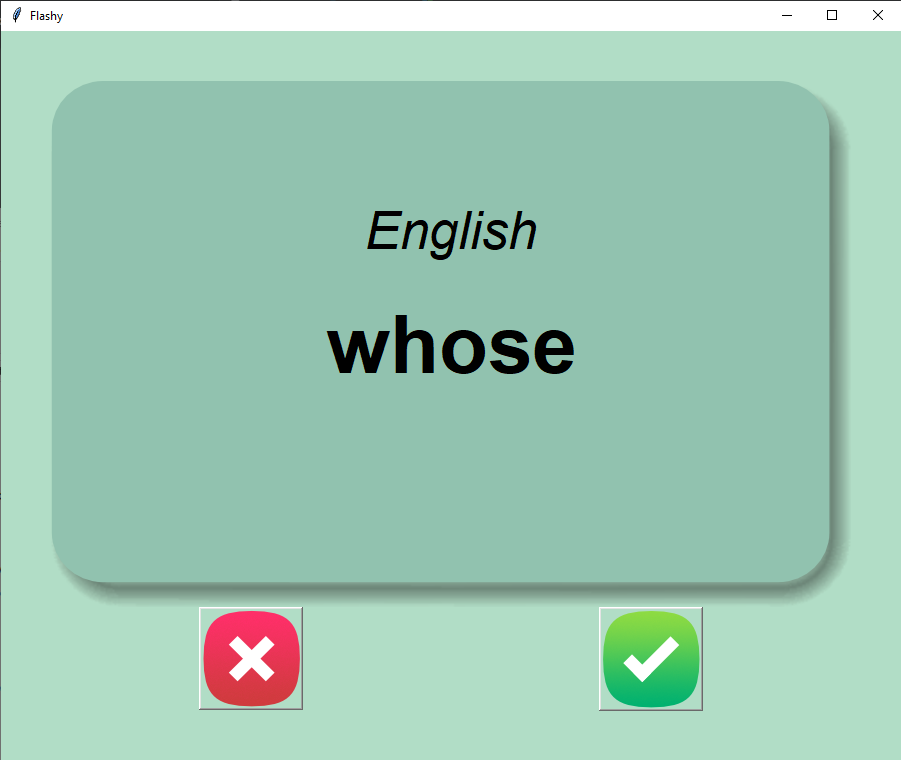
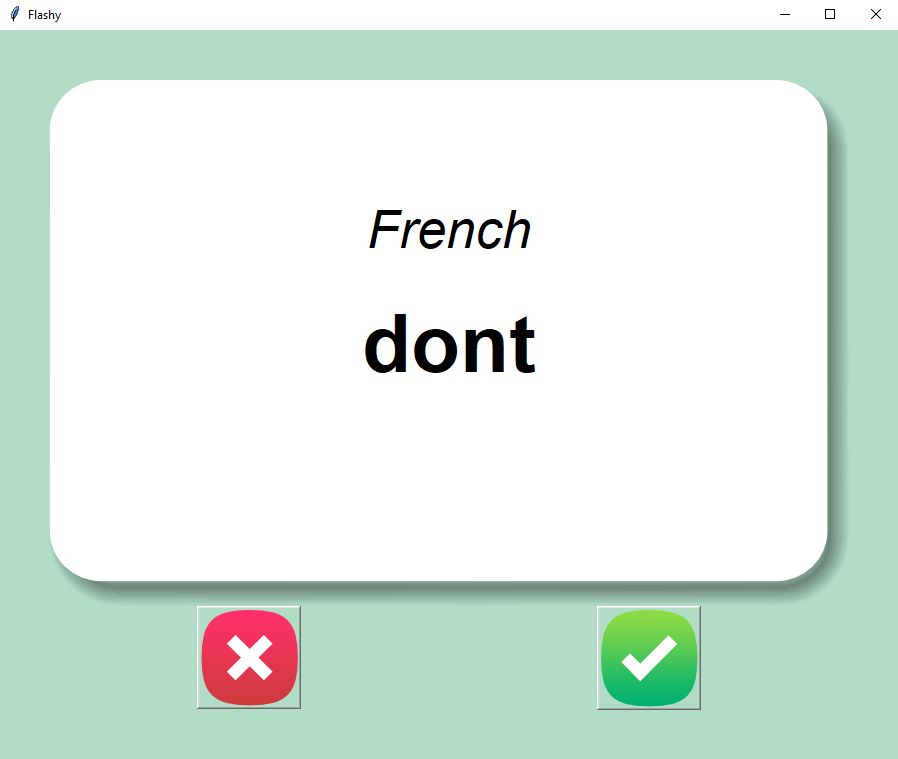

# Flash card
> An app to practise English-French vocabulary.
> 
 

## Table of Contents
* [General Info](#general-information)
* [Technologies Used](#technologies-used)
* [Features](#features)
* [Project Status](#project-status)

## General Information
The application shows words in English and after few second it shows a French translation. If word is guessed correcly, after clickng on the green button, word is deleted from words that left to learn.
If the red button is clicked the word stays in data base.

## Technologies Used
- Python 3.12

## Features
List the ready features here:
- "Flipping" card with translation (English ->French)
- Deleting learned words lerned words from the file

## Project Status
Project is: _complete_ 
